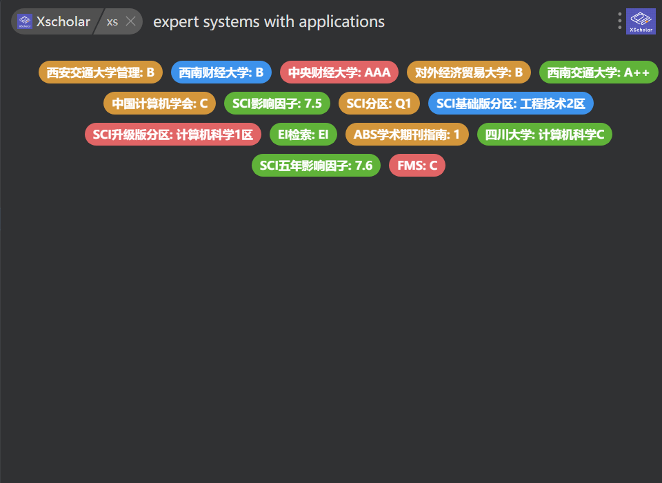

# XScholar

* [ ] 

## 功能特点

- 支持查询期刊的多种分类信息：
  - SCI 收录情况
  - JCR 分区
  - 中国各大高校认定的期刊分类

## 安装

1. 项目文件夹 `XScholar.ups`直接拖拽到utools。
2. utools插件市场搜索 `XScholar`。

## 使用方法

1. 在 uTools 中输入以下任意关键词唤起插件：

   - `xs`
   - `xscholar`
   - `scholar`
   - `journal`
   - `paper`
2. 输入期刊名称，按回车键进行查询

## 技术说明

- 本插件基于 easyscholar 开放 API 实现
- 使用 uTools 插件开发框架构建

## 作者

Zhiyi Zeng, 西安交通大学。

## 版本

v1.0.0

### Buy me a coffee ☕

